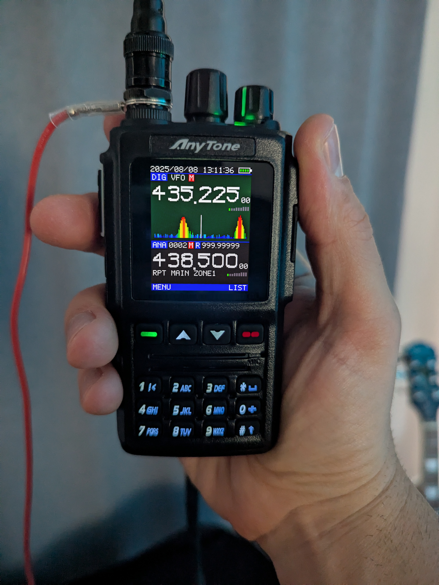

Copyright (c) 2025, Luis Quesada Torres (HB9IPH) - https://github.com/lquesada | www.luisquesada.com

# radioUIdesigns

Tests and experiments on alternate UIs for radios.

This code was written using AI.

# Anytone AT-D168UV

128x160.

Click to try a live demo!

(This is not firmware, this doesn't run in an actual device, it's overlayed on the transceiver picture!)
